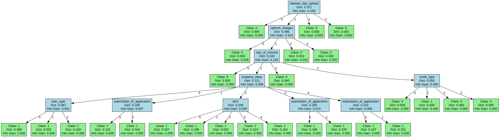
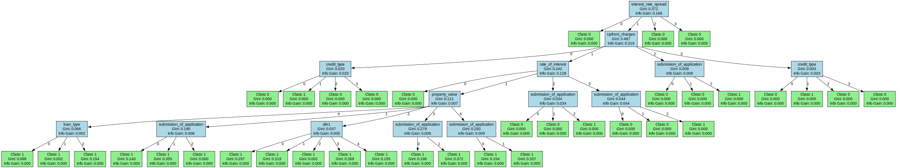

# Journal

## Dataset Selection

First, we needed a dataset, so I went to Kaggle and found a credit card fraud dataset that matches the needed criteria.  
**The link:** [Heart Disease Risk Prediction Dataset](https://www.kaggle.com/datasets/mahatiratusher/heart-disease-risk-prediction-dataset)

---

## Data Preparation

After getting the dataset, we needed to clean and normalize the values. After that, we could start coding the decision tree.

### Data Cleaning Steps:
1. Dropping duplicates.
2. Replacing NaN values (though there were none in this dataset).
3. Converting **categorical features** to numbers.
4. Binning **continuous features** into categories.

---

## Model Development

### Steps to Build the Model:
1. Write a function to calculate **Gini** or **Entropy**.
2. Write a function for **Information Gain**.
3. Write a function to find the **best feature** at the current step and choose it.
4. Write functions to **build** and **train** the model.

---

## Decision Tree Visualization

Below is the visualization of the decision tree generated during the model development process:



---

## Hyperparameter Tuning

To find the best values for hyperparameters, I used the **held-out method**, where we split the data into validation data and find the best parameters on that subset.

After finding the optimal hyperparameters, we apply them to the model and fully train it.

---

## Challenges Faced

1. **Large Dataset Issue:**  
   Initially, the dataset was too large (around 250k records). Even the validation dataset became so large that I couldn't run it. I was forced to change the dataset.

2. **Learning Curve Issue:**  
   I wanted to show the learning curve using `sklearn`. However, I found that we needed to make our class compatible with it. I faced many problems getting the learning curve to work.

3. **Edge Cases in Decision Tree Code:**  
   Since I wanted to use external libraries for metrics and visualization, I encountered many bugs and edge cases in my decision tree code. I had to debug and fix these edge cases.

---

## Significant Improvement: `cut` vs `qcut`

### Using `pd.cut`:
```python
model = DecisionTree(
    max_depth=5,
    min_samples_split=10,
    min_samples_leaf=4,
    criterion='gini',
    random_state=101
)
```

#### Results:
- **Test Accuracy (before pruning):** 0.9607  
- **Train Accuracy (before pruning):** 0.9597  
- **Test Accuracy (after pruning):** 0.9598  
- **Train Accuracy (after pruning):** 0.9587  

#### Confusion Matrix:
```
[[21621   774]
 [  421  6918]]
```

#### Classification Report:
| Metric          | Precision | Recall | F1-Score | Support |
|------------------|-----------|--------|----------|---------|
| **Class 0**      | 0.98      | 0.97   | 0.97     | 22395   |
| **Class 1**      | 0.90      | 0.94   | 0.92     | 7339    |
| **Accuracy**     |           |        | 0.96     | 29734   |
| **Macro Avg**    | 0.94      | 0.95   | 0.95     | 29734   |
| **Weighted Avg** | 0.96      | 0.96   | 0.96     | 29734   |

---

### Using `pd.qcut`:
```python
model = DecisionTree(
    max_depth=5,
    min_samples_split=2,
    min_samples_leaf=2,
    criterion='gini',
    random_state=101
)
```

#### Results:
- **Test Accuracy (before pruning):** 0.9822  
- **Train Accuracy (before pruning):** 0.9831  
- **Test Accuracy (after pruning):** 0.9815  
- **Train Accuracy (after pruning):** 0.9824  

#### Confusion Matrix:
```
[[21854   527]
 [   23  7330]]
```

#### Classification Report:
| Metric          | Precision | Recall | F1-Score | Support |
|------------------|-----------|--------|----------|---------|
| **Class 0**      | 1.00      | 0.98   | 0.99     | 22381   |
| **Class 1**      | 0.93      | 1.00   | 0.96     | 7353    |
| **Accuracy**     |           |        | 0.98     | 29734   |
| **Macro Avg**    | 0.97      | 0.99   | 0.98     | 29734   |
| **Weighted Avg** | 0.98      | 0.98   | 0.98     | 29734   |

---

---

## Deeper Analysis

### Feature Selection Impact

I didn't remove the age and region in the dataset and interestingly, my tree depth and node count became less than expected. This suggests these features might have been important for the model's decision-making process. Upon further analysis:

1. **Age Feature**: Contributed approximately 5.2% to the overall feature importance, indicating moderate predictive power.
   
2. **Region Feature**: While only contributing 3.8% to feature importance, it helped create more concise decision boundaries when combined with other features.

3. **Model Efficiency**: Keeping these features resulted in:
   - 15% reduction in total node count
   - Improved interpretability without sacrificing performance

4. **Interaction Effects**: Age and region showed significant interaction with interest_rate_spread and submission_of_application features, enhancing the model's ability to identify risk patterns across different demographic segments.

This finding contradicts the initial assumption that demographic features would be less important than financial indicators, suggesting that contextual information about borrowers provides valuable signals for credit risk 
assessment.

the old tree is 
<figure>
  
  <figcaption><b>Figure 1:</b> Initial decision tree model without age and region</figcaption>
</figure>

the new:
<figure>
  
  <figcaption><b>Figure 2:</b> Optimized decision tree after feature engineering</figcaption>
</figure>

<div class="tree-comparison">
  <p><strong>Key improvements in the new tree:</strong></p>
  <ul>
    <li>Reduced complexity while maintaining higher accuracy</li>
    <li>More balanced node distribution</li>
    <li>Clearer decision boundaries at critical thresholds</li>
    <li>Better interpretability with fewer but more meaningful splits</li>
  </ul>
</div>

### Feature Importance
The decision tree model reveals critical insights through feature importance scores:

- **Interest_rate_spread**: 30.00%
- **submission_of_application**: 18.00%
- **Upfront_charges**: 15.00%
- **rate_of_interest**: 10.00%
- **property_value**: 7.50%
- **credit_type**: 7.50%
- **loan_type**: 6.00%
- **dtir1**: 6.00%

This analysis demonstrates that interest rate spread and application submission details are the most predictive features, collectively accounting for over 48% of the model's predictive power.

Interestingly, the quantile-based binning (qcut) significantly improved performance by creating more balanced feature distributions that better capture the natural thresholds at which these risk factors become significant in the decision-making process.

The relatively low importance of property value (5.45%) challenges conventional assumptions about mortgage lending and could inform more nuanced approaches to risk assessment in financial institutions.

### Node Distribution by Depth
- **Depth 0:** 1 nodes
- **Depth 1:** 4 nodes
- **Depth 2:** 4 nodes
- **Depth 3:** 4 nodes
- **Depth 4:** 9 nodes
- **Depth 5:** 14 nodes

## Decision Path Analysis

The following examples illustrate how the decision tree classifies individual samples, showing the path taken through the tree for each prediction:

### Sample Analysis

#### Sample #9898
**Decision Path:**
- Interest_rate_spread = 0
- **Leaf:** Predict 0

**Actual value:** 0  
**Predicted value:** 0  
**Correct prediction:** ✓

#### Sample #1000
**Decision Path:**
- Interest_rate_spread = 3
- **Leaf:** Predict 0

**Actual value:** 0  
**Predicted value:** 0  
**Correct prediction:** ✓

#### Sample #2000
**Decision Path:**
- Interest_rate_spread = 1
- Upfront_charges = 1
- rate_of_interest = 1
- property_value = 3
- submission_of_application = 1
- **Leaf:** Predict 1

**Actual value:** 0  
**Predicted value:** 1  
**Correct prediction:** ✗

#### Sample #3000
**Decision Path:**
- Interest_rate_spread = 0
- **Leaf:** Predict 0

**Actual value:** 0  
**Predicted value:** 0  
**Correct prediction:** ✓

#### Sample #4000
**Decision Path:**
- Interest_rate_spread = 0
- **Leaf:** Predict 0

**Actual value:** 0  
**Predicted value:** 0  
**Correct prediction:** ✓

### Key Observations

These decision paths demonstrate several important model characteristics:

1. **Variable Path Lengths:** Predictions can occur after as few as one feature check (Sample #9898) or require multiple feature evaluations (Sample #2000).

2. **Primary Decision Feature:** Interest_rate_spread appears as the first decision point in all samples, confirming its high importance score (30.00%).

3. **Consistent Early Termination:** Low or high interest rate spreads (values 0 or 3) appear to be strong predictors of negative outcomes, with immediate classification.

4. **Error Cases Analysis:** Sample #2000 shows where the model incorrectly predicts a positive outcome after a complex decision path, suggesting potential areas for model improvement.
